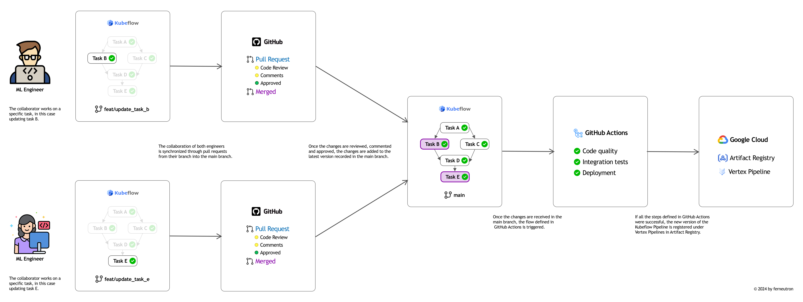

# MLOps

This repository aims to showcase a use case under an MLOps paradigm using GCP as the cloud provider and GitHub Actions as the CICD flow manager.

The detailed explanation of this repository can be found in the article I published in Towards Data Science called: [Part 1: Let's Build an Operational MLOps Framework from Scratch](https://medium.com/@ferneutron/part-1-lets-build-an-operational-mlops-framework-from-scratch-29dd17914e71)

## 1. Getting started

This repository contains the resources to carry out what is described in the following flow




In order to adjust this repository to your use case, I recommend you follow the guide I described in the article [Part 1: Let's Build an Operational MLOps Framework from Scratch](https://medium.com/@ferneutron/part-1-lets-build-an-operational-mlops-framework-from-scratch-29dd17914e71) or, if applicable, in the next section I explain which files you would have to modify to be able to use this content.

## 2. Usage

First, in GCP you will need to create a [Workload Identity Provider](https://cloud.google.com/iam/docs/workload-identity-federation) which will enable the connection between GitHub and GCP.

You will also need to create a service account with the following roles:

```sh
"roles/artifactregistry.writer"
"roles/bigquery.readSessionUser"
"roles/cloudbuild.builds.builder"
"roles/cloudbuild.tokenAccessor"
"roles/cloudbuild.workerPoolUser"
"roles/logging.logWriter"
"roles/iam.serviceAccountUser"
"roles/aiplatform.user"
"roles/developerconnect.user"
"roles/storage.objectCreator"
```

Then, the service account you created will have to be associated with the [Workload Identity Pool](https://cloud.google.com/iam/docs/manage-workload-identity-pools-providers).

Finally, in the `.github/workflows/cicd.yaml` file, you will need to adjust the variables `PROJECT_ID`, `WORKLOAD_IDENTITY_PROVIDER` and `SERVICE_ACCOUNT` in the `cd` job for the step `GCP Auth`. This change must look like:

```yaml
- name: 'GCP Auth'
  uses: 'google-github-actions/auth@v0.4.0'
  with:
    project_id: ${{ vars.PROJECT_ID }}
    workload_identity_provider: ${{ vars.WORKLOAD_IDENTITY_PROVIDER }}
    service_account: ${{ vars.SERVICE_ACCOUNT }}

- name: Register
  run: |
    curl -X POST \
    -H "Authorization: Bearer $(gcloud auth print-access-token)" \
    -F tags=latest \
    -F content=@pipeline.yaml \
    ${{ vars.PIPELINE_REPOSITORY }}
```

And that is pretty much it!

## What is next?

This repo will be updated as I add other MLOps resources (continuous training, model monitoring, data validation, etc.). So as soon as I can, I will be updating this `README` and the repository code.

Happy coding 🤓!
